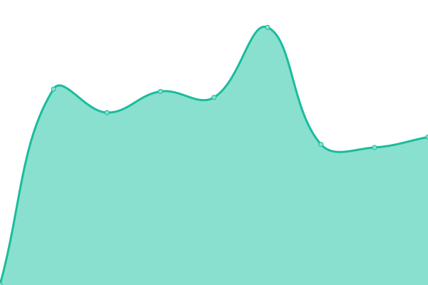

# [📈 Live Status](https://tdviet.github.io/uptime-dynamic-dns-service): <!--live status--> **🟧 Partial outage**

This repository contains the open-source uptime monitor and status page for [Viet Tran](https://tdviet.github.io/uptime-dynamic-dns-service), powered by [Upptime](https://github.com/upptime/upptime).

With [Upptime](https://upptime.js.org), you can get your own unlimited and free uptime monitor and status page, powered entirely by a GitHub repository. We use [Issues](https://github.com/tdviet/uptime-dynamic-dns-service/issues) as incident reports, [Actions](https://github.com/tdviet/uptime-dynamic-dns-service/actions) as uptime monitors, and [Pages](https://tdviet.github.io/uptime-dynamic-dns-service) for the status page.

<!--start: status pages-->
<!-- This summary is generated by Upptime (https://github.com/upptime/upptime) -->
<!-- Do not edit this manually, your changes will be overwritten -->
<!-- prettier-ignore -->
| URL | Status | History | Response Time | Uptime |
| --- | ------ | ------- | ------------- | ------ |
|  [Dynamic DNS service](https://nsupdate.fedcloud.eu) | 🟩 Up | [dynamic-dns-service.yml](https://github.com/IISAS/fedcloud.eu-uptime-dynamic-dns-service/commits/HEAD/history/dynamic-dns-service.yml) | 

 749ms
     
 | 

<a href="https://uptime.fedcloud.eu/history/dynamic-dns-service">100.00%</a>
    

|  [EOSC-Synergy Horizon dashboard](https://dashboard.fedcloud.eosc-synergy.eu/) | 🟩 Up | [eosc-synergy-horizon-dashboard.yml](https://github.com/IISAS/fedcloud.eu-uptime-dynamic-dns-service/commits/HEAD/history/eosc-synergy-horizon-dashboard.yml) | 

 966ms
     
 | 

<a href="https://uptime.fedcloud.eu/history/eosc-synergy-horizon-dashboard">100.00%</a>
    

|  [DSpace testing repository](http://dspace-iisas.repository.fedcloud.eu:8080/xmlui/) | 🟩 Up | [d-space-testing-repository.yml](https://github.com/IISAS/fedcloud.eu-uptime-dynamic-dns-service/commits/HEAD/history/d-space-testing-repository.yml) | 

 810ms
     
 | 

<a href="https://uptime.fedcloud.eu/history/d-space-testing-repository">100.00%</a>
    

|  [Dataverse testing repository](https://dataverse-iisas.repository.fedcloud.eu/) | 🟥 Down | [dataverse-testing-repository.yml](https://github.com/IISAS/fedcloud.eu-uptime-dynamic-dns-service/commits/HEAD/history/dataverse-testing-repository.yml) | 

 0ms
     
 | 

<a href="https://uptime.fedcloud.eu/history/dataverse-testing-repository">100.00%</a>
    

|  [IISAS Horizon dashboard](https://horizon.ui.savba.sk/) | 🟩 Up | [iisas-horizon-dashboard.yml](https://github.com/IISAS/fedcloud.eu-uptime-dynamic-dns-service/commits/HEAD/history/iisas-horizon-dashboard.yml) | 

 558ms
     
 | 

<a href="https://uptime.fedcloud.eu/history/iisas-horizon-dashboard">100.00%</a>
    

<!--end: status pages-->

[**Visit our status website →**](https://tdviet.github.io/uptime-dynamic-dns-service)

## 📄 License

- Powered by: [Upptime](https://github.com/upptime/upptime)
- Code: [MIT](./LICENSE) © [Viet Tran](https://tdviet.github.io/uptime-dynamic-dns-service)
- Data in the `./history` directory: [Open Database License](https://opendatacommons.org/licenses/odbl/1-0/)
